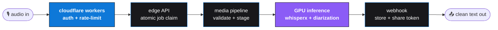

<!-- ════════════════════════════════════════════════════════════════════ -->
<!--   scriptivox · founders: arsh + abhishek                            -->
<!-- ════════════════════════════════════════════════════════════════════ -->

<a name="top"></a>

<!-- ─── CINEMATIC HEADER ─────────────────────────────────────────────── -->
<div align="center">
  <picture>
    <source media="(prefers-color-scheme: dark)" srcset="https://capsule-render.vercel.app/api?type=waving&color=0:0e78d8,100:8b5cf6&height=320&section=header&text=scriptivox&fontSize=110&fontColor=ffffff&fontAlignY=40&desc=voice%20is%20the%20new%20keyboard.&descSize=28&descAlignY=68&descColor=ffffff&animation=fadeIn">
    <source media="(prefers-color-scheme: light)" srcset="https://capsule-render.vercel.app/api?type=waving&color=0:0e78d8,100:8b5cf6&height=320&section=header&text=scriptivox&fontSize=110&fontColor=ffffff&fontAlignY=40&desc=voice%20is%20the%20new%20keyboard.&descSize=28&descAlignY=68&descColor=ffffff&animation=fadeIn">
    
  </picture>
</div>

<!-- ─── ANIMATED TYPING ──────────────────────────────────────────────── -->
<div align="center">
  <a href="https://scriptivox.com">
    
  </a>
</div>

<br/>

<!-- ─── IDENTITY STRIP ───────────────────────────────────────────────── -->
<div align="center">
  <a href="https://scriptivox.com"></a>
  <a href="https://scriptivox.com/docs"></a>
  <a href="https://linkedin.com/in/arsh911"></a>
  
</div>

<br/>
<br/>

<!-- ─── FOUNDERS / SPEC CARD ─────────────────────────────────────────── -->

<table align="center" width="100%">
  <tr>
    <td colspan="2" align="center">
      <h2>SCRIPTIVOX</h2>
      <h4>founders &nbsp;·&nbsp; <a href="https://linkedin.com/in/arsh911">arsh</a> &nbsp;+&nbsp; abhishek</h4>
    </td>
  </tr>
  <tr>
    <td align="right" width="22%"><h4>category</h4></td>
    <td><h4>voice infrastructure for the post-keyboard era</h4></td>
  </tr>
  <tr>
    <td align="right"><h4>today</h4></td>
    <td><h4>transcription API used in production</h4></td>
  </tr>
  <tr>
    <td align="right"><h4>tomorrow</h4></td>
    <td><h4>scriptivox speech &nbsp;·&nbsp; voice-first input &nbsp;·&nbsp; system-wide</h4></td>
  </tr>
  <tr>
    <td align="right"><h4>traction</h4></td>
    <td><h4>$X,XXX MRR &nbsp;·&nbsp; growing every month</h4></td>
  </tr>
  <tr>
    <td align="right"><h4>customers</h4></td>
    <td><h4>developers, teams, recording studios, podcasters</h4></td>
  </tr>
  <tr>
    <td align="right"><h4>hq</h4></td>
    <td><h4>coquitlam, BC 🇨🇦</h4></td>
  </tr>
</table>

<br/>
<br/>

<!-- ════════════════════════════════════════════════════════════════════
                              ▶ TODAY
═════════════════════════════════════════════════════════════════════════ -->

<div align="center">
  
</div>

<p align="center">
<h3 align="center">
scriptivox turns audio into clean, accurate, multilingual text.<br/>
records meetings, ships a developer API, exports your audio into nine different formats.<br/>
used by paying customers every day, in 119 languages.
</h3>
</p>

<br/>

<table align="center" width="100%">
  <tr><td width="50%"><h3>🎙 &nbsp; meeting recording</h3></td><td><h4>calendar auto-join, async summaries, share links</h4></td></tr>
  <tr><td><h3>🔌 &nbsp; public API</h3></td><td><h4><code>$0.20</code> per hour, async, presigned uploads, webhooks</h4></td></tr>
  <tr><td><h3>📦 &nbsp; MCP server</h3></td><td><h4>bring transcription straight into claude desktop</h4></td></tr>
  <tr><td><h3>🌐 &nbsp; 119 languages</h3></td><td><h4>auto-detected, speaker-diarized, word-level timestamps</h4></td></tr>
  <tr><td><h3>📤 &nbsp; 9 export formats</h3></td><td><h4>srt · vtt · pdf · docx · txt · ass · sbv · stl · csv</h4></td></tr>
  <tr><td><h3>🛠 &nbsp; 42 free tools</h3></td><td><h4>trim, convert, join, edit audio in your browser</h4></td></tr>
  <tr><td><h3>💼 &nbsp; dashboard</h3></td><td><h4>stripe billing, teams, audit logs, row-level security</h4></td></tr>
  <tr><td><h3>🌎 &nbsp; 27 converters</h3></td><td><h4>mp3↔srt, mp4↔vtt, every combo you'd ever paste-and-pray</h4></td></tr>
</table>

<br/>

<p align="center">
  <a href="https://scriptivox.com"></a>
  &nbsp;
  <a href="https://scriptivox.com/docs"></a>
</p>

<br/>
<br/>

<!-- ════════════════════════════════════════════════════════════════════
                            ▶ TOMORROW
═════════════════════════════════════════════════════════════════════════ -->

<div align="center">
  
</div>

<h3 align="center">
the keyboard is the slowest part of your computer.<br/>
people speak three times faster than they type, and yet every product on your screen still asks you to type.<br/>
we think that ends.
</h3>

<br/>

<h3 align="center">
<b>scriptivox speech</b> is system-wide voice-first input.<br/>
you hold a key. you talk. you let go. clean text appears.<br/>
anywhere you'd normally type. no transcripts to copy-paste. no separate app to open.<br/>
just speak, get text, keep working.
</h3>

<br/>

<table align="center" width="100%">
  <tr>
    <th><h3>where you'd be typing</h3></th>
    <th><h3>what speech does instead</h3></th>
  </tr>
  <tr><td align="center"><h4>slack messages</h4></td><td align="center"><h4>speak in full sentences</h4></td></tr>
  <tr><td align="center"><h4>emails to your team</h4></td><td align="center"><h4>five times faster than typing</h4></td></tr>
  <tr><td align="center"><h4>notion docs</h4></td><td align="center"><h4>stay in flow, no context switch</h4></td></tr>
  <tr><td align="center"><h4>github issues</h4></td><td align="center"><h4>punctuation handled for you</h4></td></tr>
  <tr><td align="center"><h4>every comment thread</h4></td><td align="center"><h4>every app, every textbox</h4></td></tr>
  <tr><td align="center"><h4>every keyboard shortcut</h4></td><td align="center"><h4>one hotkey to rule them all</h4></td></tr>
</table>

<br/>

<h3 align="center">
<i>same whisper pipeline that powers scriptivox transcription today.<br/>
same 119 languages. same accuracy. now everywhere you'd ever type.</i>
</h3>

<br/>

<p align="center">
  <a href="https://scriptivox.com"></a>
</p>

<br/>
<br/>

<!-- ════════════════════════════════════════════════════════════════════
                            ▶ THE API
═════════════════════════════════════════════════════════════════════════ -->

<div align="center">
  
</div>

<h3 align="center">
two endpoints. JSON in, JSON out. async by default, with webhooks the moment your transcript is ready.<br/>
no SDK lock-in. <code>$0.20</code> per audio-hour, billed by the second.
</h3>

<br/>

```bash
curl https://api.scriptivox.com/v1/transcribe \
  -H "Authorization: Bearer sk_live_..." \
  -H "Content-Type: application/json" \
  -d '{
    "url": "https://your-bucket.s3/audio.mp3",
    "webhook_url": "https://yours.app/scriptivox",
    "language": "auto",
    "diarize": true
  }'
```

```json
{
  "id": "tx_K9d2nVbq",
  "status": "completed",
  "duration_seconds": 1847,
  "language": "en",
  "speakers": 3,
  "transcript": "...",
  "formats": { "srt": "...", "vtt": "...", "txt": "..." }
}
```

<br/>

<table align="center" width="100%">
  <tr><td width="40%"><h3>async + sync</h3></td><td><h4>submit url or upload, get a webhook on completion</h4></td></tr>
  <tr><td><h3>language auto-detect</h3></td><td><h4>119 supported, or force one with a flag</h4></td></tr>
  <tr><td><h3>speaker diarization</h3></td><td><h4>who said what, with timestamps</h4></td></tr>
  <tr><td><h3>word-level timestamps</h3></td><td><h4>every word, to the millisecond</h4></td></tr>
  <tr><td><h3>9 export formats</h3></td><td><h4>srt, vtt, pdf, docx, txt, ass, sbv, stl, csv</h4></td></tr>
  <tr><td><h3>MCP-compatible</h3></td><td><h4>plugs into claude desktop natively</h4></td></tr>
  <tr><td><h3>webhook security</h3></td><td><h4>signed payloads, retries with backoff</h4></td></tr>
</table>

<br/>
<br/>

<!-- ════════════════════════════════════════════════════════════════════
                          ▶ HOW IT WORKS
═════════════════════════════════════════════════════════════════════════ -->

<div align="center">
  
</div>



<h3 align="center">
async by default. survives retries. presigned uploads. atomic job claiming.<br/>
the same backbone that will power scriptivox speech.
</h3>

<br/>
<br/>

<!-- ════════════════════════════════════════════════════════════════════
                           ▶ BUILT WITH
═════════════════════════════════════════════════════════════════════════ -->

<div align="center">
  
</div>

<div align="center">
  
</div>

<br/>

<table align="center" width="100%">
  <tr><th><h3>layer</h3></th><th><h3>what we use</h3></th></tr>
  <tr><td align="center"><h3>frontend</h3></td><td><h4>next.js · typescript · tailwind · radix · shadcn · ffmpeg-wasm</h4></td></tr>
  <tr><td align="center"><h3>edge</h3></td><td><h4>cloudflare workers for routing, auth, rate-limit</h4></td></tr>
  <tr><td align="center"><h3>api</h3></td><td><h4>typescript, deno runtime, async-first</h4></td></tr>
  <tr><td align="center"><h3>inference</h3></td><td><h4>whisperx for transcription · diarization layer · GPU-backed</h4></td></tr>
  <tr><td align="center"><h3>data</h3></td><td><h4>postgres with row-level security</h4></td></tr>
  <tr><td align="center"><h3>ops</h3></td><td><h4>stripe · sentry · vercel</h4></td></tr>
</table>

<br/>
<br/>

<!-- ════════════════════════════════════════════════════════════════════
                       ▶ SHIPPING IN PUBLIC
═════════════════════════════════════════════════════════════════════════ -->

<div align="center">
  
</div>

<div align="center">
  
  
</div>

<br/>

<div align="center">
  
</div>

<br/>

<div align="center">
  <picture>
    <source media="(prefers-color-scheme: dark)" srcset="https://raw.githubusercontent.com/arsh-911/arsh-911/output/github-contribution-grid-snake-dark.svg">
    <source media="(prefers-color-scheme: light)" srcset="https://raw.githubusercontent.com/arsh-911/arsh-911/output/github-contribution-grid-snake.svg">
    
  </picture>
</div>

<br/>
<br/>

<!-- ════════════════════════════════════════════════════════════════════
                              ▶ CTA
═════════════════════════════════════════════════════════════════════════ -->

<div align="center">
  
</div>

<h3 align="center">
follow the build. try the product. join the waitlist for speech.<br/>
we ship every week.
</h3>

<br/>

<p align="center">
  <a href="https://scriptivox.com"></a>
  &nbsp;
  <a href="https://scriptivox.com"></a>
  &nbsp;
  <a href="https://linkedin.com/in/arsh911"></a>
</p>

<br/>

<div align="center">
  <picture>
    <source media="(prefers-color-scheme: dark)" srcset="https://capsule-render.vercel.app/api?type=waving&color=0:8b5cf6,100:0e78d8&height=140&section=footer&animation=fadeIn">
    <source media="(prefers-color-scheme: light)" srcset="https://capsule-render.vercel.app/api?type=waving&color=0:8b5cf6,100:0e78d8&height=140&section=footer&animation=fadeIn">
    
  </picture>
</div>
